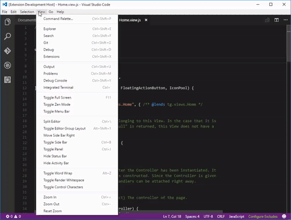

# openui5-require README

openui5-require is a plugin for Visual Studio Code that automatically adds all the used sap* class on your file and places them on the sap.ui.define function.

## Features

Adds the command "Scan current file" on visual studio code which will parse the contents of the file and updates the sap.ui.define function with all classes used on your file.




Example code:

```
sap.ui.define([
    "sap/m/Button",
], function (Button) {
    "use strict";
    sap.ui.jsview("com.view.Home", {

        getControllerName: function () {
            return "com.view.Home";
        },

        /**
        * Is initially called once after the Controller has been instantiated. It
        * is the place where the UI is constructed. Since the Controller is given
        * to this method, its event handlers can be attached right away.
        */
        createContent: function (oController) {
            var ctlDashboard;

            this.oPage = new sap.m.Page({
                title: "",
                showHeader: false,
                width: "100%",
                height: "100%",
                content: [
                    new sap.m.Text({ text: "Hello World!" }),

                    new Button({ text: "Click me!" })
                ],
                visible: true
            });

            return this.oPage;
        }

    });
});
```


Output:

```
sap.ui.define([
    "sap/m/Button",
    "sap/m/Page",
    "sap/m/Text",
], function (Button, Page, Text) {
    "use strict";
    sap.ui.jsview("com.view.Home", {

        getControllerName: function () {
            return "com.view.Home";
        },

        /**
        * Is initially called once after the Controller has been instantiated. It
        * is the place where the UI is constructed. Since the Controller is given
        * to this method, its event handlers can be attached right away.
        */
        createContent: function (oController) {
            var ctlDashboard;

            this.oPage = new Page({
                title: "",
                showHeader: false,
                width: "100%",
                height: "100%",
                content: [
                    new Text({ text: "Hello World!" }),

                    new Button({ text: "Click me!" })
                ],
                visible: true
            });

            return this.oPage;
        }

    });
});
```

## Extension Settings

This extension contributes the following settings:

* `ui5requirer.libraries`: list of string containing the libraries to parse for (eg. sap.m., sap.ui.core., etc)
* `ui5requirer.excluded`: list of string containing the classes to ignore (eg. sap.ui.define, sap.ui.getCore, etc)

## Known Issues

This is still a WIP so please let me know if you encounter any issues.

## Release Notes

### 0.1

Initial release

**Enjoy!**
